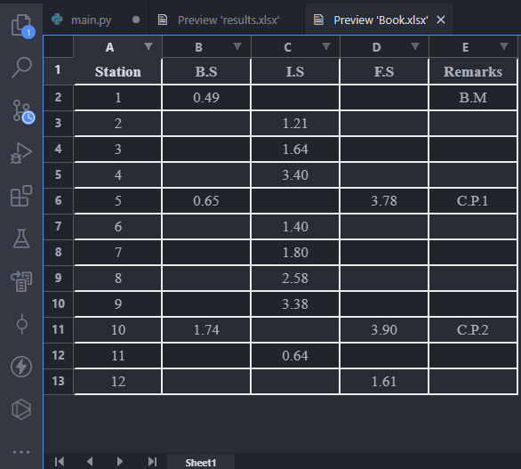
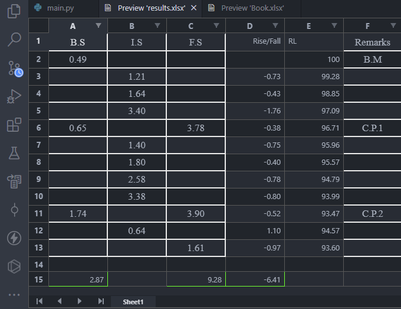

# Computations for the Rise and Fall Method

## The rise and fall method is the method of calculating the difference in elevation between consecutive points in levelling work. This script automates the process.

## This is how the initial excel file should look.

## This is how the output excel file would look like.

